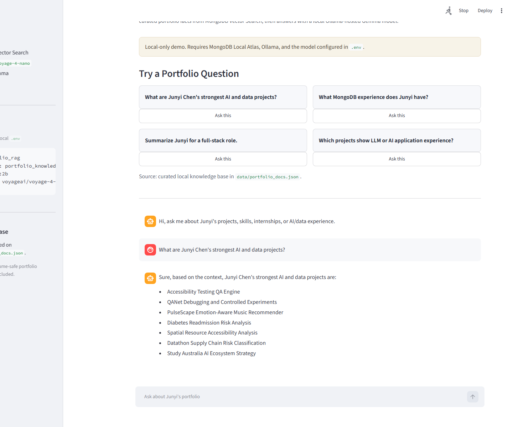
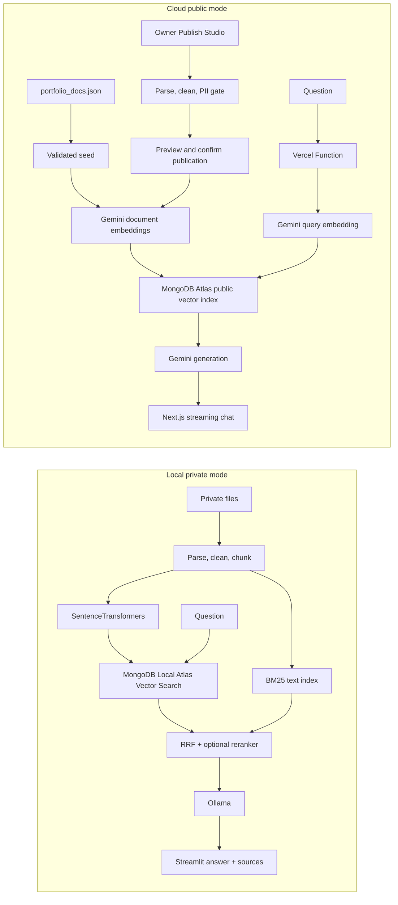

# Local + Cloud Portfolio RAG Assistant

A bilingual portfolio assistant with two deliberately separated privacy modes:

- **Local private mode:** Streamlit, MongoDB Local Atlas, SentenceTransformers, and Ollama.
- **Cloud public mode:** Next.js, Vercel Functions, MongoDB Atlas Vector Search, and Gemini.

Development status and handoff context are maintained in [Project Status](docs/project-memory/CURRENT_STATE.md).

The project began with the Google for Developers and MongoDB **Building with RAG using Gemma 4, Antigravity 2.0 & MongoDB Atlas** workshop repository, then evolved into an independent product with document processing, retrieval evaluation, source evidence, privacy controls, and a deployable cloud chat.



## What It Demonstrates

1. **Ingestion:** parse JSON, Markdown, TXT, CSV, DOCX, and PDF; clean, deduplicate, chunk, embed, and index.
2. **Retrieval:** local mode uses independent Vector Search and BM25 candidate pools, RRF fusion, adaptive routing, and an optional Cross-Encoder reranker; cloud mode accepts the same retrieval-mode contract and reports the actual public-only path plus any fallback.
3. **Context engineering:** token-aware chunks store raw evidence separately from title, project, source, and update-date retrieval prefixes.
4. **Grounded generation:** combine traceable profile fact cards with selected raw evidence and return a clear fallback when evidence is insufficient.
5. **Evaluation:** compare baseline, hybrid, and reranked retrieval on a fixed 50-question bilingual benchmark using hit/recall@k, MRR, nDCG, privacy, no-answer, and latency metrics.
6. **Bounded Agentic RAG:** simple questions use one retrieval; comparison and summary questions use at most three subqueries and two rounds.
7. **Privacy:** local private documents are Git ignored; the cloud seed accepts only curated public data.

## Architecture



The two modes use separate collections and indexes because their embedding models differ:

| Mode | Collection | Embedding | Generation |
|---|---|---|---|
| Local | `portfolio_knowledge_local` | multilingual MiniLM (default) or `voyageai/voyage-4-nano` | Ollama (`qwen2.5:3b` or Gemma) |
| Cloud | `portfolio_knowledge_public` | `gemini-embedding-001` | Gemini Flash |

Local mode keeps Vector Search and text-search indexes separate, fuses their rankings with RRF, and may add a multilingual Cross-Encoder. Cloud requests now use the same mode names (`vector`, `bm25`, `hybrid`, `hybrid-rerank`, and `adaptive`) but resolve them through public Atlas capabilities on each request. If `text_index_public` is unavailable, cloud `bm25`, `hybrid`, and `adaptive` precision paths explicitly report a Vector Search fallback instead of silently pretending Hybrid is active. Do not make adaptive the public default until a current cloud benchmark beats the Vector baseline without no-answer or privacy regression.

### Measured retrieval baseline

The tracked 50-question bilingual benchmark separates answerable, exact-term, cross-document, freshness, no-answer, and privacy cases. Results measured locally on the current curated 111-document / 689-child index:

| Mode | Hit@5 | Recall@5 | MRR | nDCG@5 | No-answer | Privacy violations | Avg retrieval latency |
|---|---:|---:|---:|---:|---:|---:|
| Vector baseline | 0.925 | 0.838 | 0.906 | 0.830 | 1.000* | 0 | 182 ms |
| Hybrid RRF | 0.925 | 0.838 | 0.867 | 0.813 | 1.000* | 0 | 93 ms |
| Hybrid + multilingual reranker | **1.000** | **0.954** | **0.924** | **0.889** | **1.000** | **0** | 1.49 s |

`*` No-answer and sensitive-private cases are rejected by a deterministic pre-retrieval safety gate. The fast hybrid mode remains the default UI path; the higher-latency reranker is an explicit local toggle and Retrieval Lab experiment.

## Local Private Mode

### Prerequisites

- Python 3.10 or 3.11
- Docker Desktop
- A local Python environment created with `uv sync`

```powershell
Copy-Item .env.example .env
uv sync
```

Configure `.env`:

```dotenv
LOCAL_MONGODB_URI=mongodb://localhost:62262/?directConnection=true
LOCAL_COLLECTION_NAME=portfolio_knowledge_local
OLLAMA_BASE_URL=http://localhost:11434
OLLAMA_MODEL=qwen2.5:3b
EMBEDDING_MODEL_ID=sentence-transformers/paraphrase-multilingual-MiniLM-L12-v2
```

### One-command startup

Open Docker Desktop and wait until it shows **Engine running**, then run:

```powershell
powershell -ExecutionPolicy Bypass -File .\scripts\start-local.ps1
```

The script creates persistent MongoDB Atlas Local and Ollama containers, downloads the configured model when needed, migrates saved processing profiles, builds the Vector and BM25 indexes when needed, runs the smoke test, and starts Streamlit. Open [http://localhost:8505](http://localhost:8505). Keep the terminal open while using Streamlit.

Before starting services, the script reuses a healthy Streamlit server already listening on port `8505`, rejects an unhealthy or unknown listener, prints the current Git branch/commit, and runs a real Streamlit import/render preflight for all three pages. Run that preflight by itself with:

```powershell
.\.venv\Scripts\python.exe scripts\check_streamlit_pages.py
```

The first startup downloads container images and the Ollama model and can take several minutes. Later starts reuse the named Docker volumes. To inspect the stack or stop its containers without deleting data:

```powershell
powershell -ExecutionPolicy Bypass -File .\scripts\check-local.ps1
powershell -ExecutionPolicy Bypass -File .\scripts\stop-local.ps1
```

The image downloads run sequentially and retry transient failures. If Docker reports a CDN `TLS handshake timeout`, Docker Desktop's engine/proxy cannot currently reach the image layer; wait for the network to recover or restart Docker Desktop, then run the same startup command again. Completed layers are reused.

Force a new embedding and Vector Search index after changing the knowledge base:

```powershell
powershell -ExecutionPolicy Bypass -File .\scripts\start-local.ps1 -Reindex
```

`-Reindex` now rebuilds both `vector_index` and `text_index`. It is required once after upgrading from the vector-only version because contextual retrieval text and the BM25 index are new.

The optional high-precision reranker downloads `cross-encoder/mmarco-mMiniLMv2-L12-H384-v1` on first use. Keep it disabled for the fastest chat response; enable it for accuracy experiments or difficult exact/comparison questions.

### Manual development commands

Once the containers and model are ready, these commands remain available:

```powershell
.\.venv\Scripts\python.exe scripts\ingest.py
.\.venv\Scripts\python.exe scripts\smoke_test.py
.\.venv\Scripts\python.exe -m unittest discover -s tests -v
```

Launch the three-page local application:

```powershell
.\.venv\Scripts\python.exe -m streamlit run app.py --server.port 8505
```

Open [http://localhost:8505](http://localhost:8505). The sidebar exposes **Chat**, **Knowledge Studio**, and **Retrieval Lab**.

`scripts/ingest.py` is not a normal startup step. Run it only on the first setup, after changing public/private documents, after changing the embedding model, or when explicitly rebuilding the index.

### Knowledge Studio library manager

Knowledge Studio keeps the complete private document catalog in the Git-ignored `data/local_catalog.sqlite3`. The original files and the existing `local_private_docs.json` scan are not deleted. Run the one-time migration manually when needed:

```powershell
.\.venv\Scripts\python.exe scripts\migrate_local_catalog.py
```

The four tabs support:

- **Upload & Chunk:** automatic per-file recommendations, editable parsed/clean text, configurable whitespace/URL/email preprocessing, General/Parent-child/Resume semantic modes, delimiters, parent/child token limits, PII warnings, hierarchy previews, and an in-memory Top-5 test that does not write to MongoDB.
- **Library:** search, filters, pagination, full-text and chunk inspection, RAG summary overrides, public JSON editing, and private document activation/exclusion. Exclusion never deletes the original file.
- **Versions & Duplicates:** exact duplicate groups and human-confirmed resume/upload version recommendations.
- **Index Maintenance:** active document counts, stale-index detection, visible ingestion progress, and the separate Atlas cloud-sync reminder.

#### Reset to a manual-upload knowledge base

The **Index Maintenance > Danger Zone** can reset local knowledge while preserving every external Word, PDF, code, and project source file. It first creates a SQLite backup, chat export, reset manifest, runtime-evaluation copies, and internal-upload copies under the Git-ignored private backup directory. The reset requires the exact phrase `RESET PORTFOLIO`.

After reset, the local catalog contains only an empty `Portfolio` space. Guard settings prevent `local_private_docs.json` and `data/portfolio_docs.json` from being imported automatically, so only documents uploaded or activated manually enter the local index. The reset clears local searchable chunks, chat history, and generated evaluation runs; it does not remove Docker volumes, Ollama models, MongoDB indexes, formal benchmarks, or external source files.

DOCX resumes now default to deterministic semantic parents with child retrieval blocks. Education, internship, project, award, and skill entities are isolated; an oversized entity is split only inside itself and repeats its title. General parent-child mode defaults to roughly 700-token answer parents and 180-token retrieval children. MongoDB Vector Search and BM25 index the children, while answers and source panels expand each match to its parent evidence. Repeated summaries and skill variants share semantic groups so they cannot fill Top-K. Each document persists its complete processing profile, so preview, temporary retrieval, saved configuration, and ingestion use the same boundaries. Images and scanned PDFs are marked `needs_ocr`; OCR is intentionally not enabled in this version.

The local Master resume verification produces 28 semantic parents and 40 retrieval children instead of seven mixed chunks. Its separate 10-question resume benchmark can be run with:

```powershell
.\.venv\Scripts\python.exe scripts\evaluate_resume_chunks.py
```

Retrieval Lab exposes four comparable modes: Vector, BM25 full-text, Hybrid RRF, and Hybrid + local Cross-Encoder rerank. Result cards show retrieval channels, Vector/BM25 ranks, RRF score, reranker score, and request latency. If the optional reranker cannot load, the page reports the fallback reason and continues with Hybrid retrieval.

### Local troubleshooting

| Symptom | Meaning | Action |
|---|---|---|
| Docker Desktop is open but `docker ps` is empty | The engine is running but the project services have not been created | Run `scripts/start-local.ps1` |
| `localhost:11434` refuses the connection | Ollama is not running | Run the startup script and inspect `docker logs portfolio-rag-ollama` |
| `localhost:62262` refuses the connection | MongoDB Atlas Local is not running | Run the startup script and inspect `docker logs portfolio-rag-mongodb` |
| The configured model is missing | Ollama is available but the `.env` model has not been downloaded | The startup script automatically runs `ollama pull` |
| Streamlit loads but chat is disabled | One or more runtime checks failed | Read the MongoDB, Embedding, and Ollama diagnostics shown in the page |
| Port `8505` is already in use | A healthy Streamlit app may already be open, or another process owns the port | The startup script now exits successfully when Streamlit health is OK; otherwise stop the reported process or its terminal before retrying |
| Retrieval Lab reports a reranker warning | Cross-Encoder is unavailable or its first download failed | Retrieval automatically falls back to hybrid; restore network access and retry high-precision mode later |
| Index rebuild spends many minutes generating embeddings | `voyageai/voyage-4-nano` is too heavy for the current CPU or the private scan contains too many low-value files | Use the multilingual MiniLM default; ingestion curates project README/docs and master resume evidence while preserving the full private source file locally |

For Chinese-first answers keep `OLLAMA_MODEL=qwen2.5:3b`. To reproduce the workshop with the smaller Gemma model, set `OLLAMA_MODEL=gemma:2b` and run the startup script again.

The original workshop-compatible `voyageai/voyage-4-nano` embedding remains configurable, but the default multilingual MiniLM model is substantially faster on CPU and supports Chinese and English retrieval. Changing embedding models always requires a complete reindex.

## Cloud Public Mode

```powershell
npm install
npm test
npm run build
```

Server-only variables:

```dotenv
MONGODB_URI=mongodb+srv://...
GEMINI_API_KEY=...
CLOUD_DB_NAME=portfolio_rag
CLOUD_COLLECTION_NAME=portfolio_knowledge_public
CLOUD_VECTOR_INDEX_NAME=vector_index_public
GEMINI_EMBEDDING_MODEL=gemini-embedding-001
GEMINI_CHAT_MODEL=gemini-3.5-flash
CLOUD_DOCUMENTS_COLLECTION_NAME=portfolio_public_documents
CLOUD_DRAFTS_COLLECTION_NAME=portfolio_public_drafts
CLOUD_METADATA_COLLECTION_NAME=portfolio_public_metadata
CLOUD_SPACES_COLLECTION_NAME=portfolio_public_spaces
NEXT_PUBLIC_CLERK_PUBLISHABLE_KEY=...
CLERK_SECRET_KEY=...
NEXT_PUBLIC_CLERK_SIGN_IN_URL=/sign-in
OWNER_EMAILS=verified-owner@example.com
```

Validate and publish the curated data separately from the web deployment:

```powershell
npm run seed:atlas
npm run seed:atlas:apply
npm run dev
```

`npm run seed:atlas` is validation-only. Writing repository documents to Atlas requires the explicit `seed:atlas:apply` command and its built-in confirmation token. This prevents a retained or locally edited `data/portfolio_docs.json` from silently repopulating a deliberately empty public knowledge base.

`seed:atlas:apply` reconciles `text_index_public` without deleting unrelated Atlas indexes. If Atlas refuses the Search index because the tier has no remaining index capacity, the app continues with Vector Search and `/api/retrieve` reports the fallback in its retrieval diagnostics.

When the retrieval chunks already exist and only the new public Knowledge catalog needs to be populated, use the quota-free catalog backfill. It does not call Gemini or regenerate embeddings:

```powershell
node scripts/seed-atlas.mjs --catalog-only
```

After upgrading an existing Atlas deployment to Knowledge Spaces, run the quota-free metadata and index migration. It assigns legacy records to `portfolio` and adds `space_id` filters without regenerating embeddings:

```powershell
node scripts/seed-atlas.mjs --spaces-only
```

Compare public cloud retrieval modes without calling the chat/generation endpoint:

```powershell
npm run evaluate:cloud -- --base-url=https://your-deployment.example --modes=vector,adaptive,hybrid
```

The report is written to `evals/latest-cloud-retrieval.json`, which is Git ignored. Keep the cloud default on Vector unless the report shows an adaptive or hybrid candidate meeting or beating Vector on Hit@5 and MRR with `no_answer_accuracy=1.000` and `privacy_violations=0`.

The Vercel application provides:

- `/` streaming bilingual Chat with expandable sources.
- `/knowledge` searchable public document catalog with allowlisted metadata only.
- `/lab` read-only Retrieval Lab for Top-K and threshold inspection.
- `/architecture` privacy boundaries, runtime evidence, and screenshots.
- `/studio` Owner-only Publish Studio after Clerk and `OWNER_EMAILS` are configured.
- `/api/health` Atlas, Gemini, and vector index status without secret values.

### Knowledge Spaces

Both runtimes organize documents into spaces instead of mixing unrelated subjects into one retrieval pool. The only starter space is **Portfolio**; additional spaces are created manually when a genuinely separate knowledge base is needed. A document belongs to one space, while a question may select one space or compare up to five. Cross-space controls stay hidden until at least two active spaces exist.

- Chat, Retrieval Lab, Knowledge, and Publish Studio share the same space contract.
- A missing selection defaults to `portfolio` for backward compatibility.
- Multi-space retrieval embeds the question once, retrieves inside each selected space, and reserves evidence from every space with matches before filling the remaining Top-K positions.
- Moving a document only updates catalog and chunk metadata; it does not regenerate embeddings or spend Gemini quota.
- Archived spaces stop appearing in public APIs and stop retrieval immediately, while their documents remain recoverable.
- Local SQLite spaces and private documents never appear in Vercel or public APIs.

The local one-command startup runs `scripts/migrate_knowledge_spaces.py` before index checks. Existing SQLite documents and MongoDB chunks are assigned to Portfolio, and the Vector/BM25 index definitions gain a `space_id` filter without changing embeddings.

### Owner Publish Studio

Cloud publication is intentionally not an anonymous upload feature. A verified Clerk user whose primary email appears in `OWNER_EMAILS` can:

1. Upload PDF, DOCX, Markdown, TXT, or CSV files up to 4 MB each.
2. Edit parsed and cleaned text, then run mandatory email, phone, identity-number, and address checks.
3. Preview Standard, Parent-child, or Resume semantic chunks before any external model receives the text.
4. Publish only PII-clean public chunks with the existing `gemini-embedding-001` contract.
5. Revise, unpublish, archive, permanently delete, or export Owner-created public records.

Draft text expires from `portfolio_public_drafts` after seven days. Original uploaded files are never persisted. Publishing is idempotent and transactional, and quota failures keep the draft ready for a later retry. Repository seed operations update only `source_origin=repo_seed`; they never delete `owner_upload` records.

Clerk public sign-up should be disabled in the Clerk dashboard. `/studio` and every `/api/admin/*` handler also perform server-side Owner authorization, returning `401` for signed-out users and `403` for authenticated non-Owners.

The Owner-only **Publish Studio > Danger Zone** exports all managed public spaces, drafts, documents, chunks without embeddings, and publication metadata as JSON. A SHA-256 fingerprint binds the downloaded backup to the current cloud state; if the data changes, the reset is rejected until a fresh backup is downloaded. Entering `RESET PORTFOLIO` then clears only this application's managed collections and keeps Atlas, indexes, Clerk, Vercel configuration, and the empty `Portfolio` space.

## Demo Questions

- `Junyi 最有代表性的 AI 和数据项目有哪些？`
- `Junyi 有哪些 MongoDB 相关经验？`
- `Which projects demonstrate LLM or RAG application experience?`
- `Why is Junyi a strong fit for a full-stack role?`

## Privacy Guarantees

- `data/portfolio_docs.json` is the only cloud seed source.
- `data/local_private_docs.json`, `data/local_uploads/`, `.env*`, and local evaluation data are Git ignored.
- `evals/rag_benchmark.json` contains questions and expected document IDs only; generated benchmark reports remain Git ignored.
- Cloud retrieval always filters `visibility: public` and maps results through an allowlisted `Source` contract.
- The public Knowledge API never returns cleaned bodies, chunks, embeddings, Owner IDs, or management fields.
- Chat messages are sent for generation but are not persisted by the cloud app.
- Cloud uploads remain transient drafts until the Owner removes PII, previews chunks, and explicitly publishes them.

## Verification

```powershell
.\.venv\Scripts\python.exe -m py_compile src\portfolio_rag.py src\document_processing.py src\ingestion.py src\retrieval.py app.py
.\.venv\Scripts\python.exe -m pytest
.\.venv\Scripts\python.exe scripts\check_streamlit_pages.py
.\.venv\Scripts\python.exe scripts\evaluate_retrieval.py --mode baseline
.\.venv\Scripts\python.exe scripts\evaluate_retrieval.py --mode hybrid
$env:HF_HUB_OFFLINE='1'; $env:TRANSFORMERS_OFFLINE='1'; .\.venv\Scripts\python.exe scripts\evaluate_retrieval.py --mode hybrid-rerank
.\.venv\Scripts\python.exe scripts\evaluate_resume_chunks.py
npm test
npm run build
node scripts/seed-atlas.mjs --validate
npm run evaluate:cloud -- --base-url=https://your-deployment.example --limit=5
```

## Resume Description

**Dual-mode Portfolio RAG Assistant | Python, Next.js, MongoDB Vector/Search, BM25, RRF, SentenceTransformers, Ollama, Gemini, Vercel**

- Built an end-to-end bilingual RAG system with resume-aware semantic chunking, token budgets, independent dense/BM25 retrieval, RRF fusion, optional Cross-Encoder reranking, grounded prompting, and traceable citations.
- Separated a local private workflow using MongoDB Local Atlas and Ollama from a shareable Vercel demo using MongoDB Atlas Vector Search and Gemini, with isolated collections and explicit public-data validation.
- Added a 50-question bilingual benchmark with hit/recall@k, MRR, nDCG, no-answer and privacy checks, plus bounded multi-query routing for comparison and summary questions.

## Repository Layout

```text
app.py                         Local Streamlit Chat
pages/                         Knowledge Studio and Retrieval Lab
src/                           Python processing, ingestion, retrieval, generation
data/portfolio_docs.json       Curated public knowledge source
data/portfolio_profile.json    Traceable structured public facts
evals/rag_benchmark.json       Fixed bilingual retrieval benchmark
evals/resume_semantic_benchmark.json  Private-resume semantic retrieval cases
app/                           Next.js pages and Vercel route handlers
components/                    Chat, evidence, navigation, retrieval UI
lib/cloud-rag/                 Atlas, Gemini, validation, prompt, rate limit, SSE
scripts/ingest.py              Local index build
scripts/evaluate_resume_chunks.py  In-memory semantic-resume evaluation
scripts/evaluate-cloud-retrieval.mjs  Public `/api/retrieve` benchmark
scripts/seed-atlas.mjs         Validated public Atlas seed
tests/                         Python and TypeScript unit tests
```
