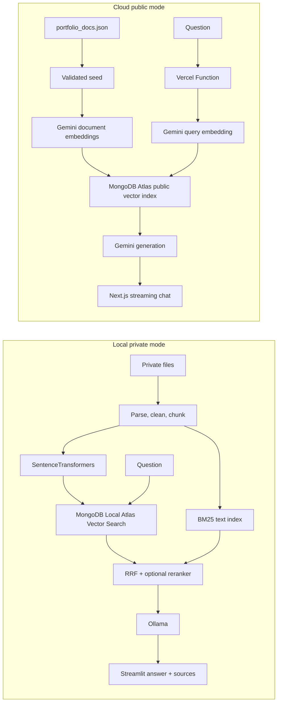

# Local + Cloud Portfolio RAG Assistant

A bilingual portfolio assistant with two deliberately separated privacy modes:

- **Local private mode:** Streamlit, MongoDB Local Atlas, SentenceTransformers, and Ollama.
- **Cloud public mode:** Next.js, Vercel Functions, MongoDB Atlas Vector Search, and Gemini.

The project began with the Google for Developers and MongoDB **Building with RAG using Gemma 4, Antigravity 2.0 & MongoDB Atlas** workshop repository, then evolved into an independent product with document processing, retrieval evaluation, source evidence, privacy controls, and a deployable cloud chat.


## What It Demonstrates

1. **Ingestion:** parse JSON, Markdown, TXT, CSV, DOCX, and PDF; clean, deduplicate, chunk, embed, and index.
2. **Retrieval:** local mode uses independent Vector Search and BM25 candidate pools, RRF fusion, and an optional Cross-Encoder reranker; the deployed cloud mode uses stable public-only Vector Search.
3. **Context engineering:** token-aware chunks store raw evidence separately from title, project, source, and update-date retrieval prefixes.
4. **Grounded generation:** combine traceable profile fact cards with selected raw evidence and return a clear fallback when evidence is insufficient.
5. **Evaluation:** compare baseline, hybrid, and reranked retrieval on a fixed 50-question bilingual benchmark using hit/recall@k, MRR, nDCG, privacy, no-answer, and latency metrics.
6. **Bounded Agentic RAG:** simple questions use one retrieval; comparison and summary questions use at most three subqueries and two rounds.
7. **Privacy:** local private documents are Git ignored; the cloud seed accepts only curated public data.

## Architecture



The two modes use separate collections and indexes because their embedding models differ:

| Mode | Collection | Embedding | Generation |
|---|---|---|---|
| Local | `portfolio_knowledge_local` | multilingual MiniLM (default) or `voyageai/voyage-4-nano` | Ollama (`qwen2.5:3b` or Gemma) |
| Cloud | `portfolio_knowledge_public` | `gemini-embedding-001` | Gemini Flash |

Local mode keeps Vector Search and text-search indexes separate, fuses their rankings with RRF, and may add a multilingual Cross-Encoder. The current Vercel deployment stays lightweight and uses public-only Vector Search because the Atlas free tier has no spare full-text search index slot. Cloud BM25 code remains an optional capability and must not be described as active until a text index is provisioned and verified.

### Measured retrieval baseline

The tracked 50-question bilingual benchmark separates answerable, exact-term, cross-document, freshness, no-answer, and privacy cases. Results measured locally on the current curated 111-document / 478-chunk index:

| Mode | Hit@5 | Recall@5 | MRR | No-answer | Privacy violations | Avg retrieval latency |
|---|---:|---:|---:|---:|---:|---:|
| Vector baseline | 0.925 | 0.838 | 0.906 | 1.000* | 0 | ~80 ms |
| Hybrid + multilingual reranker | **0.975** | **0.946** | **0.923** | **1.000** | **0** | ~1.79 s |

`*` No-answer and sensitive-private cases are rejected by a deterministic pre-retrieval safety gate. The fast hybrid mode remains the default UI path; the higher-latency reranker is an explicit local toggle and Retrieval Lab experiment.

## Local Private Mode

### Prerequisites

- Python 3.10 or 3.11
- Docker Desktop
- A local Python environment created with `uv sync`

```powershell
Copy-Item .env.example .env
uv sync
```

Configure `.env`:

```dotenv
LOCAL_MONGODB_URI=mongodb://localhost:62262/?directConnection=true
LOCAL_COLLECTION_NAME=portfolio_knowledge_local
OLLAMA_BASE_URL=http://localhost:11434
OLLAMA_MODEL=qwen2.5:3b
EMBEDDING_MODEL_ID=sentence-transformers/paraphrase-multilingual-MiniLM-L12-v2
```

### One-command startup

Open Docker Desktop and wait until it shows **Engine running**, then run:

```powershell
powershell -ExecutionPolicy Bypass -File .\scripts\start-local.ps1
```

The script creates persistent MongoDB Atlas Local and Ollama containers, downloads the configured model when needed, builds the vector index on first use, runs the smoke test, and starts Streamlit. Open [http://localhost:8505](http://localhost:8505). Keep the terminal open while using Streamlit.

Before starting services, the script prints the current Git branch/commit, rejects a stale process already using port `8505`, and runs a real Streamlit import/render preflight for all three pages. Run that preflight by itself with:

```powershell
.\.venv\Scripts\python.exe scripts\check_streamlit_pages.py
```

The first startup downloads container images and the Ollama model and can take several minutes. Later starts reuse the named Docker volumes. To inspect the stack or stop its containers without deleting data:

```powershell
powershell -ExecutionPolicy Bypass -File .\scripts\check-local.ps1
powershell -ExecutionPolicy Bypass -File .\scripts\stop-local.ps1
```

The image downloads run sequentially and retry transient failures. If Docker reports a CDN `TLS handshake timeout`, Docker Desktop's engine/proxy cannot currently reach the image layer; wait for the network to recover or restart Docker Desktop, then run the same startup command again. Completed layers are reused.

Force a new embedding and Vector Search index after changing the knowledge base:

```powershell
powershell -ExecutionPolicy Bypass -File .\scripts\start-local.ps1 -Reindex
```

`-Reindex` now rebuilds both `vector_index` and `text_index`. It is required once after upgrading from the vector-only version because contextual retrieval text and the BM25 index are new.

The optional high-precision reranker downloads `cross-encoder/mmarco-mMiniLMv2-L12-H384-v1` on first use. Keep it disabled for the fastest chat response; enable it for accuracy experiments or difficult exact/comparison questions.

### Manual development commands

Once the containers and model are ready, these commands remain available:

```powershell
.\.venv\Scripts\python.exe scripts\ingest.py
.\.venv\Scripts\python.exe scripts\smoke_test.py
.\.venv\Scripts\python.exe -m unittest discover -s tests -v
```

Launch the three-page local application:

```powershell
.\.venv\Scripts\python.exe -m streamlit run app.py --server.port 8505
```

Open [http://localhost:8505](http://localhost:8505). The sidebar exposes **Chat**, **Knowledge Studio**, and **Retrieval Lab**.

`scripts/ingest.py` is not a normal startup step. Run it only on the first setup, after changing public/private documents, after changing the embedding model, or when explicitly rebuilding the index.

### Knowledge Studio library manager

Knowledge Studio keeps the complete private document catalog in the Git-ignored `data/local_catalog.sqlite3`. The original files and the existing `local_private_docs.json` scan are not deleted. Run the one-time migration manually when needed:

```powershell
.\.venv\Scripts\python.exe scripts\migrate_local_catalog.py
```

The four tabs support:

- **Upload & Chunk:** automatic per-file recommendations, manual overrides, PII warnings, chunk metrics, previews, and a temporary Top-5 retrieval test that does not write to MongoDB.
- **Library:** search, filters, pagination, full-text and chunk inspection, RAG summary overrides, public JSON editing, and private document activation/exclusion. Exclusion never deletes the original file.
- **Versions & Duplicates:** exact duplicate groups and human-confirmed resume/upload version recommendations.
- **Index Maintenance:** active document counts, stale-index detection, visible ingestion progress, and the separate Atlas cloud-sync reminder.

Default chunk recommendations are `600/60` for DOCX/resumes, `800/80` for Markdown, `700/70` for TXT, `800/100` for text PDFs, `800/0` for short JSON/CSV, and `900/80` for code. Each document persists its own strategy, chunk size, and overlap, so preview and ingestion use the same boundaries. Images and scanned PDFs are marked `needs_ocr`; OCR is intentionally not enabled in this version.

### Local troubleshooting

| Symptom | Meaning | Action |
|---|---|---|
| Docker Desktop is open but `docker ps` is empty | The engine is running but the project services have not been created | Run `scripts/start-local.ps1` |
| `localhost:11434` refuses the connection | Ollama is not running | Run the startup script and inspect `docker logs portfolio-rag-ollama` |
| `localhost:62262` refuses the connection | MongoDB Atlas Local is not running | Run the startup script and inspect `docker logs portfolio-rag-mongodb` |
| The configured model is missing | Ollama is available but the `.env` model has not been downloaded | The startup script automatically runs `ollama pull` |
| Streamlit loads but chat is disabled | One or more runtime checks failed | Read the MongoDB, Embedding, and Ollama diagnostics shown in the page |
| Port `8505` is already in use | An older Streamlit or another process is still listening | Stop the old terminal with `Ctrl+C`; the startup script reports its PID and never kills unknown processes automatically |
| Retrieval Lab reports a reranker warning | Cross-Encoder is unavailable or its first download failed | Retrieval automatically falls back to hybrid; restore network access and retry high-precision mode later |
| Index rebuild spends many minutes generating embeddings | `voyageai/voyage-4-nano` is too heavy for the current CPU or the private scan contains too many low-value files | Use the multilingual MiniLM default; ingestion curates project README/docs and master resume evidence while preserving the full private source file locally |

For Chinese-first answers keep `OLLAMA_MODEL=qwen2.5:3b`. To reproduce the workshop with the smaller Gemma model, set `OLLAMA_MODEL=gemma:2b` and run the startup script again.

The original workshop-compatible `voyageai/voyage-4-nano` embedding remains configurable, but the default multilingual MiniLM model is substantially faster on CPU and supports Chinese and English retrieval. Changing embedding models always requires a complete reindex.

## Cloud Public Mode

```powershell
npm install
npm test
npm run build
```

Server-only variables:

```dotenv
MONGODB_URI=mongodb+srv://...
GEMINI_API_KEY=...
CLOUD_DB_NAME=portfolio_rag
CLOUD_COLLECTION_NAME=portfolio_knowledge_public
CLOUD_VECTOR_INDEX_NAME=vector_index_public
GEMINI_EMBEDDING_MODEL=gemini-embedding-001
GEMINI_CHAT_MODEL=gemini-3.5-flash
```

Validate and publish the curated data separately from the web deployment:

```powershell
node scripts/seed-atlas.mjs --validate
npm run seed:atlas
npm run dev
```

The Vercel application provides:

- `/` streaming bilingual Chat with expandable sources.
- `/lab` read-only Retrieval Lab for Top-K and threshold inspection.
- `/architecture` privacy boundaries, runtime evidence, and screenshots.
- `/api/health` Atlas, Gemini, and vector index status without secret values.

## Demo Questions

- `Junyi 最有代表性的 AI 和数据项目有哪些？`
- `Junyi 有哪些 MongoDB 相关经验？`
- `Which projects demonstrate LLM or RAG application experience?`
- `Why is Junyi a strong fit for a full-stack role?`

## Privacy Guarantees

- `data/portfolio_docs.json` is the only cloud seed source.
- `data/local_private_docs.json`, `data/local_uploads/`, `.env*`, and local evaluation data are Git ignored.
- `evals/rag_benchmark.json` contains questions and expected document IDs only; generated benchmark reports remain Git ignored.
- Cloud retrieval always filters `visibility: public` and maps results through an allowlisted `Source` contract.
- Chat messages are sent for generation but are not persisted by the cloud app.
- Uploaded documents must be previewed and explicitly approved before public publication.

## Verification

```powershell
.\.venv\Scripts\python.exe -m py_compile src\portfolio_rag.py src\document_processing.py src\ingestion.py src\retrieval.py app.py
.\.venv\Scripts\python.exe -m pytest
.\.venv\Scripts\python.exe scripts\check_streamlit_pages.py
.\.venv\Scripts\python.exe scripts\evaluate_retrieval.py --mode baseline
.\.venv\Scripts\python.exe scripts\evaluate_retrieval.py --mode hybrid
npm test
npm run build
node scripts/seed-atlas.mjs --validate
```

## Resume Description

**Dual-mode Portfolio RAG Assistant | Python, Next.js, MongoDB Vector/Search, BM25, RRF, SentenceTransformers, Ollama, Gemini, Vercel**

- Built an end-to-end bilingual RAG system with token-aware contextual chunking, independent dense/BM25 retrieval, RRF fusion, optional Cross-Encoder reranking, grounded prompting, and traceable citations.
- Separated a local private workflow using MongoDB Local Atlas and Ollama from a shareable Vercel demo using MongoDB Atlas Vector Search and Gemini, with isolated collections and explicit public-data validation.
- Added a 50-question bilingual benchmark with hit/recall@k, MRR, nDCG, no-answer and privacy checks, plus bounded multi-query routing for comparison and summary questions.

## Repository Layout

```text
app.py                         Local Streamlit Chat
pages/                         Knowledge Studio and Retrieval Lab
src/                           Python processing, ingestion, retrieval, generation
data/portfolio_docs.json       Curated public knowledge source
data/portfolio_profile.json    Traceable structured public facts
evals/rag_benchmark.json       Fixed bilingual retrieval benchmark
app/                           Next.js pages and Vercel route handlers
components/                    Chat, evidence, navigation, retrieval UI
lib/cloud-rag/                 Atlas, Gemini, validation, prompt, rate limit, SSE
scripts/ingest.py              Local index build
scripts/seed-atlas.mjs         Validated public Atlas seed
tests/                         Python and TypeScript unit tests
```
