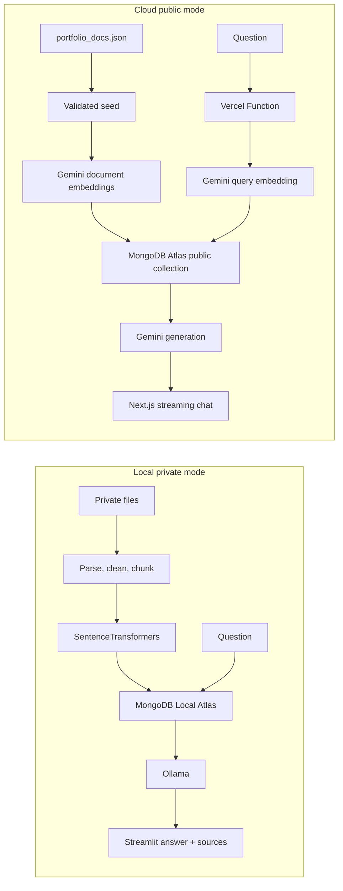

# Local + Cloud Portfolio RAG Assistant

A bilingual portfolio assistant with two deliberately separated privacy modes:

- **Local private mode:** Streamlit, MongoDB Local Atlas, SentenceTransformers, and Ollama.
- **Cloud public mode:** Next.js, Vercel Functions, MongoDB Atlas Vector Search, and Gemini.

The project began with the Google for Developers and MongoDB **Building with RAG using Gemma 4, Antigravity 2.0 & MongoDB Atlas** workshop repository, then evolved into an independent product with document processing, retrieval evaluation, source evidence, privacy controls, and a deployable cloud chat.


## What It Demonstrates

1. **Ingestion:** parse JSON, Markdown, TXT, CSV, DOCX, and PDF; clean, deduplicate, chunk, embed, and index.
2. **Retrieval:** semantic Top-K search with an optional score threshold and public/private scope.
3. **Grounded generation:** pass only selected chunks to the LLM; return a clear fallback when evidence is insufficient.
4. **Evaluation:** inspect scores and snippets in a Retrieval Lab instead of treating RAG as a black box.
5. **Privacy:** local private documents are Git ignored; the cloud seed accepts only curated public data.

## Architecture



The two modes use separate collections and indexes because their embedding models differ:

| Mode | Collection | Embedding | Generation |
|---|---|---|---|
| Local | `portfolio_knowledge_local` | `voyageai/voyage-4-nano` | Ollama (`qwen2.5:3b` or Gemma) |
| Cloud | `portfolio_knowledge_public` | `gemini-embedding-001` | Gemini Flash |

## Local Private Mode

### Prerequisites

- Python 3.10 or 3.11
- Docker Desktop
- MongoDB Local Atlas container
- Ollama container or desktop service

```powershell
Copy-Item .env.example .env
uv sync
```

Configure `.env`:

```dotenv
LOCAL_MONGODB_URI=mongodb://localhost:62262/?directConnection=true
LOCAL_COLLECTION_NAME=portfolio_knowledge_local
OLLAMA_BASE_URL=http://localhost:11434
OLLAMA_MODEL=qwen2.5:3b
```

Build the index and run tests:

```powershell
.\.venv\Scripts\python.exe scripts\ingest.py
.\.venv\Scripts\python.exe scripts\smoke_test.py
.\.venv\Scripts\python.exe -m unittest discover -s tests -v
```

Launch the three-page local application:

```powershell
.\.venv\Scripts\python.exe -m streamlit run app.py --server.port 8505
```

Open [http://localhost:8505](http://localhost:8505). The sidebar exposes **Chat**, **Knowledge Studio**, and **Retrieval Lab**.

## Cloud Public Mode

```powershell
npm install
npm test
npm run build
```

Server-only variables:

```dotenv
MONGODB_URI=mongodb+srv://...
GEMINI_API_KEY=...
CLOUD_DB_NAME=portfolio_rag
CLOUD_COLLECTION_NAME=portfolio_knowledge_public
CLOUD_VECTOR_INDEX_NAME=vector_index_public
GEMINI_EMBEDDING_MODEL=gemini-embedding-001
GEMINI_CHAT_MODEL=gemini-3.5-flash
```

Validate and publish the curated data separately from the web deployment:

```powershell
node scripts/seed-atlas.mjs --validate
npm run seed:atlas
npm run dev
```

The Vercel application provides:

- `/` streaming bilingual Chat with expandable sources.
- `/lab` read-only Retrieval Lab for Top-K and threshold inspection.
- `/architecture` privacy boundaries, runtime evidence, and screenshots.
- `/api/health` Atlas, Gemini, and vector index status without secret values.

## Demo Questions

- `Junyi 最有代表性的 AI 和数据项目有哪些？`
- `Junyi 有哪些 MongoDB 相关经验？`
- `Which projects demonstrate LLM or RAG application experience?`
- `Why is Junyi a strong fit for a full-stack role?`

## Privacy Guarantees

- `data/portfolio_docs.json` is the only cloud seed source.
- `data/local_private_docs.json`, `data/local_uploads/`, `.env*`, and local evaluation data are Git ignored.
- Cloud retrieval always filters `visibility: public` and maps results through an allowlisted `Source` contract.
- Chat messages are sent for generation but are not persisted by the cloud app.
- Uploaded documents must be previewed and explicitly approved before public publication.

## Verification

```powershell
.\.venv\Scripts\python.exe -m py_compile src\portfolio_rag.py src\document_processing.py src\ingestion.py src\retrieval.py app.py
.\.venv\Scripts\python.exe -m unittest discover -s tests -v
npm test
npm run build
node scripts/seed-atlas.mjs --validate
```

## Resume Description

**Dual-mode Portfolio RAG Assistant | Python, Next.js, MongoDB Vector Search, SentenceTransformers, Ollama, Gemini, Vercel**

- Built an end-to-end bilingual RAG system covering document parsing, configurable chunking, embedding generation, Top-K vector retrieval, grounded prompting, source citation, and retrieval evaluation.
- Separated a local private workflow using MongoDB Local Atlas and Ollama from a shareable Vercel demo using MongoDB Atlas Vector Search and Gemini, with isolated collections and explicit public-data validation.
- Implemented a Streamlit Knowledge Studio and Retrieval Lab plus a responsive Next.js chat with SSE responses, score thresholds, no-recall safeguards, health checks, and MongoDB-backed IP rate limiting.

## Repository Layout

```text
app.py                         Local Streamlit Chat
pages/                         Knowledge Studio and Retrieval Lab
src/                           Python processing, ingestion, retrieval, generation
data/portfolio_docs.json       Curated public knowledge source
app/                           Next.js pages and Vercel route handlers
components/                    Chat, evidence, navigation, retrieval UI
lib/cloud-rag/                 Atlas, Gemini, validation, prompt, rate limit, SSE
scripts/ingest.py              Local index build
scripts/seed-atlas.mjs         Validated public Atlas seed
tests/                         Python and TypeScript unit tests
```
