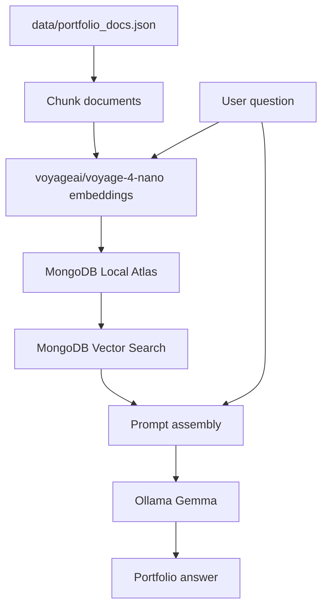

# Architecture

This project turns Junyi Chen's portfolio data into a local Retrieval-Augmented Generation assistant.

## Components

- `data/portfolio_docs.json`: portfolio knowledge base.
- `scripts/ingest.py`: chunks documents, embeds text, inserts chunks into MongoDB, and creates the vector index.
- `src/portfolio_rag.py`: reusable RAG functions for ingestion, retrieval, generation, and memory.
- `app.py`: Streamlit chat UI.
- `notebooks/rag_pipeline.ipynb`: notebook version of the pipeline for learning and experimentation.
