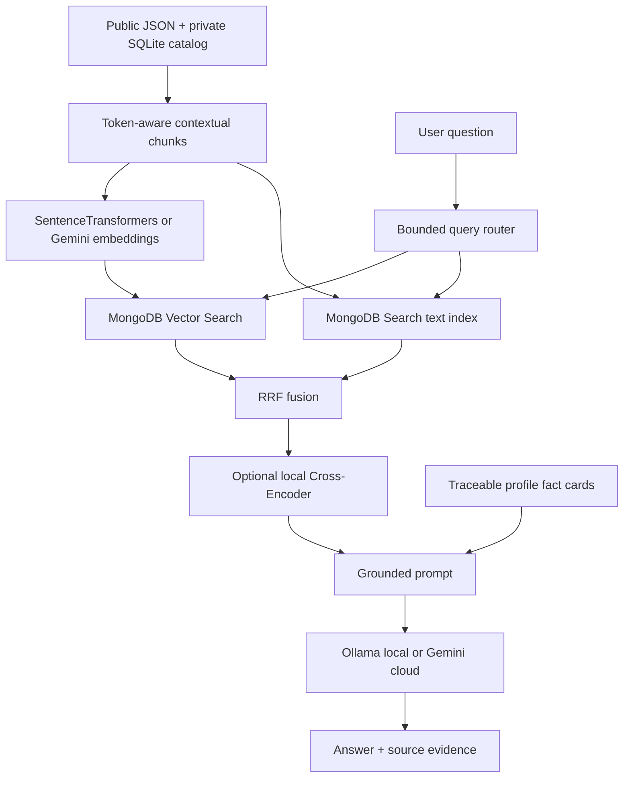

# Architecture

This project turns Junyi Chen's portfolio data into a dual-mode, evidence-grounded Retrieval-Augmented Generation assistant.

```mermaid
flowchart TD
    A["Public JSON + private SQLite catalog"] --> B["Token-aware contextual chunks"]
    B --> C["SentenceTransformers or Gemini embeddings"]
    B --> D["MongoDB Search text index"]
    C --> E["MongoDB Vector Search"]
    F["User question"] --> G["Bounded query router"]
    G --> E
    G --> D
    E --> H["RRF fusion"]
    D --> H
    H --> I["Optional local Cross-Encoder"]
    J["Traceable profile fact cards"] --> K["Grounded prompt"]
    I --> K
    K --> L["Ollama local or Gemini cloud"]
    L --> M["Answer + source evidence"]
```

## Components

- `data/portfolio_docs.json`: curated public evidence; cloud seed never reads private files.
- `data/portfolio_profile.json`: compact structured facts with source document IDs and update dates.
- `scripts/ingest.py`: contextual chunking, embeddings, MongoDB writes, and vector/text index creation.
- `src/retrieval.py`: BM25, RRF, filtering, and optional Cross-Encoder reranking.
- `src/evaluation.py`: hit/recall@k, MRR, nDCG, no-answer, privacy, and latency metrics.
- `src/query_planning.py`: deterministic simple/complex routing capped at three subqueries and two rounds.
- `src/portfolio_rag.py`: local retrieval, grounded generation, and chat history.
- `app.py`: Streamlit chat UI.
- `evals/rag_benchmark.json`: fixed 50-question bilingual evaluation set.
